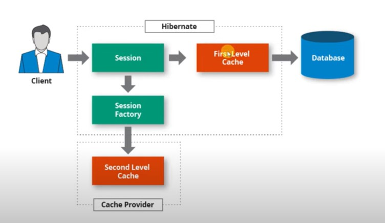
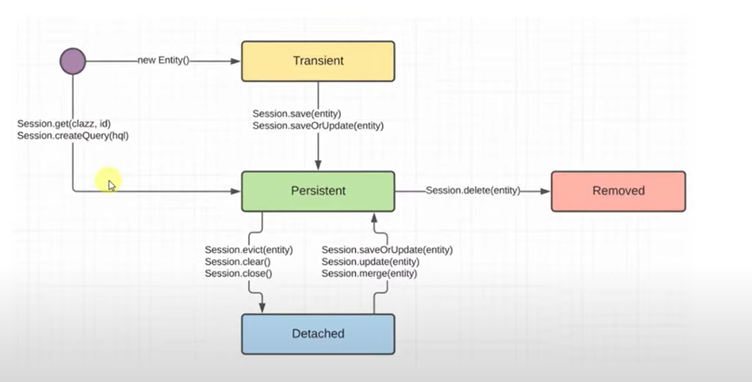

## Hibernate: Кэш, JPA, Логирование, Primary Key

### First Level Cache

Кэш **первого уровня** включён по умолчанию и действует на уровне сессии. Он управляется **PersistenceContext**, который отражает актуальное состояние базы данных. Если сущность находится в **PersistenceContext**, то повторный запрос в БД не отправляется.



Основные операции с кэшем:

1. **Session.evict(Entity)** — удаление объекта из кэша.
2. **Session.clear()** — очистка всего кэша.
3. **Session.close()** — при закрытии сессии кэш удаляется.
4. **Session.flush()** — немедленное обновление БД в соответствии с состоянием **PersistenceContext**.

Все изменения сущностей, связанных с **PersistenceContext**, будут автоматически сохранены в БД при завершении сессии, даже без явного вызова **update()**.

Каждая сессия Hibernate имеет свой собственный кэш — **PersistenceContext**.

### Жизненный цикл сущностей (Life Cycle)



1. **Transient** — объект не привязан к контексту. Это состояние сущности после создания, но до сохранения.
2. **Persistent** — объект находится в **PersistenceContext** (получен из сессии или сохранён).
3. **Removed** — объект помечен на удаление.
4. **Detached** — объект больше не связан с контекстом (после вызова **evict()**, **clear()** или закрытия сессии).

Основные методы для управления жизненным циклом:

1. **Session.refresh()** — обновление объекта текущими данными из БД.
2. **Session.delete()** — удаление объекта из базы данных.
3. **Session.evict()** — удаление объекта из контекста.
4. **Session.clear()** — очистка контекста.
5. **Session.close()** — закрытие сессии.
6. **Session.merge()** — добавление объекта в контекст или применение изменений объекта к контексту.
7. **Session.update()** — обновление объекта данными из контекста.
8. **Session.isDirty()** — проверка на наличие изменений, не сохранённых в базу данных.

### Java Persistence API (JPA)

**JPA** — это спецификация Java для работы с объектно-реляционным отображением (ORM). Она предоставляет интерфейсы и аннотации для сохранения и извлечения Java объектов в/из баз данных.

**Hibernate** — одна из самых популярных реализаций JPA.

### Разница между persist() и save():

1. **save()** возвращает сгенерированный идентификатор (ID) созданной сущности, тогда как **persist()** просто сохраняет сущность без возврата ID.
2. Если сущность уже имеет идентификатор:
   - **save()** выбрасывает исключение.
   - **persist()** игнорирует сущность и не выполняет запись в базу.
3. **save()** немедленно сохраняет данные в БД, в то время как **persist()** может отложить запись до синхронизации сессии.

### Логирование (Logging)

Популярные библиотеки для логирования в Java:

1. **log4j**
2. **jdk14l**
3. **logback**
4. **simple**

**SLF4J API** — интерфейс для работы с разными логирующими библиотеками.

Уровни логирования:

1. **FATAL** — критические ошибки, требующие немедленного исправления.
2. **ERROR** — ошибки, но приложение продолжает работать.
3. **WARN** — потенциальные проблемы.
4. **INFO** — информационные сообщения.
5. **DEBUG** — подробные отладочные сообщения.
6. **TRACE** — самый детальный уровень логирования.

### Embedded Component (Встраиваемый компонент)

1. **@Embeddable** — указывает на класс как на встроенный компонент.
2. **@Embedded** — используется над полем, которое содержит встроенный компонент (аннотация необязательна).
3. \*\*

4. **@AttributeOverride(name = "PropertyName", column = @Column(name = "ColumnName"))** — используется для переопределения названий полей встроенного компонента в базе данных. Несколько таких аннотаций могут быть применены к одному полю.

### Primary Key (Первичный ключ)

1. **@Id** — указывает, что поле является первичным ключом.
2. **@GeneratedValue(strategy = GenerationType.\*)** — указывает стратегию генерации первичного ключа:

   - **AUTO** — выбор стратегии генерации автоматически в зависимости от БД.
   - **SEQUENCE** — используется последовательность для генерации идентификаторов.
   - **IDENTITY** — ответственность за генерацию ID передаётся БД.
   - **UUID** — для генерации уникальных идентификаторов на основе UUID.

3. Для настройки генерации с последовательностью можно использовать **@SequenceGenerator(name = "user_gen", sequenceName = "users_id_seq", allocationSize = 1)** в комбинации с **GenerationType.SEQUENCE** и параметром **generator = "user_gen"**. Параметр **allocationSize** определяет, на сколько будет увеличиваться значение идентификатора при каждом вызове.

4. **Составной первичный ключ**:
   - Поля, входящие в составной ключ, объединяются в класс с аннотацией **@Embeddable**.
   - Этот класс должен реализовать интерфейс **Serializable**.
   - Поле в сущности, которое используется как составной ключ, должно быть помечено аннотацией **@EmbeddedId**.

### Отношения между сущностями: @OneToOne, @ManyToOne, @ManyToMany, Lazy Initialization

#### @OneToOne — Один к одному

Отношение "один к одному" связывает две сущности, где каждая сущность может иметь не более одной связанной сущности с другой стороны. Пример использования:

```java
@Entity
public class Employee {
   @OneToOne
   @JoinColumn(name = "address_id")
   private Address address;
}
```

#### @ManyToOne — Многие к одному

Отношение "многие к одному" означает, что множество объектов может быть связано с одним объектом. Это наиболее распространённый тип отношения в базах данных. Пример:

```java
@Entity
public class User {
   @ManyToOne
   @JoinColumn(name = "company_id")
   private Company company;
}
```

#### @OneToMany — Один ко многим

Отношение "один ко многим" подразумевает, что одна сущность может быть связана с множеством других сущностей. Обычно используется вместе с **@ManyToOne** для двусторонней связи.

```java
@Entity
public class Company {
   @OneToMany(mappedBy = "company")
   private List<User> users;
}
```

#### @ManyToMany — Многие ко многим

Это отношение создаётся, когда множество объектов одной сущности может быть связано с множеством объектов другой сущности. Реализуется с помощью промежуточной таблицы в базе данных:

```java
@Entity
public class Student {
   @ManyToMany
   @JoinTable(
      name = "student_course",
      joinColumns = @JoinColumn(name = "student_id"),
      inverseJoinColumns = @JoinColumn(name = "course_id")
   )
   private Set<Course> courses;
}
```

### Lazy Initialization (ленивая инициализация)

По умолчанию коллекции и связанные сущности загружаются лениво (**fetch = FetchType.LAZY**), что означает, что данные не загружаются сразу, а только при первом запросе. Это может привести к ошибке **LazyInitializationException**, если сессия была закрыта, а объект пытаются загрузить.

Для немедленной загрузки данных при выполнении запроса можно указать **fetch = FetchType.EAGER**.

### orphanRemoval (удаление дочерних элементов)

Атрибут **orphanRemoval = true** в аннотации **@OneToMany** позволяет удалять связанные сущности, когда они удаляются из коллекции родителя. Например, удаление пользователя из компании автоматически удалит его запись из БД.

```java
@Entity
public class Company {
   @OneToMany(mappedBy = "company", orphanRemoval = true)
   private List<User> users;
}
```

Пример удаления пользователя из компании:

```java
try (var sessionFactory = HibernateUtils.buildSessionFactory();
     var session = sessionFactory.openSession()) {
   session.beginTransaction();

   Company company = session.get(Company.class, 3);
   company.getUsers().removeIf(user -> user.getId().equals(5));

   session.getTransaction().commit();
}
```

### Переход от @ManyToMany к @ManyToOne

Часто отношения "многие ко многим" неудобны для управления, и их можно преобразовать в два отношения "многие к одному", добавив промежуточную сущность. Например, если есть отношение между студентами и курсами, можно создать сущность **Enrollment**, представляющую запись о регистрации студента на курс.

Пример преобразования:

1. Создаём промежуточную сущность **Enrollment**.

```java
@Entity
public class Enrollment {
   @ManyToOne
   @JoinColumn(name = "student_id")
   private Student student;

   @ManyToOne
   @JoinColumn(name = "course_id")
   private Course course;

   // Дополнительные атрибуты, например дата регистрации
}
```

2. Изменяем сущности **Student** и **Course** на использование связи "многие к одному" через **Enrollment**.

```java
@Entity
public class Student {
   @OneToMany(mappedBy = "student")
   private Set<Enrollment> enrollments;
}

@Entity
public class Course {
   @OneToMany(mappedBy = "course")
   private Set<Enrollment> enrollments;
}
```

Этот подход делает управление отношением более гибким и позволяет добавлять дополнительные данные, такие как дата регистрации, статус и другие атрибуты.

## 18. HIBERNATE. HQL, inheritance, H2 база, Docker, сортировка

### Сортировка

Для сортировки используется атрибут **@OrderBy** который указывается над коллекцией. В качестве параметра SQL или HQL: **@OrderBy("username DESC")**. Можно указать по какой колонке сортировать **@OrderColumn(name="id")** - сортировка в приложении.

### Тестирование

База данных H2 хранится в памяти и часто используется для тестирования приложений. У неё есть несколько параметров создания:

- create - удаляет и затем создает новую БД
- create-drop - удаляет и создает новую БД, при закрытии приложения созданная ранее БД удаляется.
- update - проверяет сущности и обновляет базу данных на их основе.
- validate - проверяет сущности и сообщает об ошибках.

Также часто используется Docker для создания контейнеров с базами данных. [Docker Test Containers](https://www.youtube.com/watch?v=8zy2Mw9IpGs).

### Наследование

**@MappedSuperclass** - используется чтобы отметить суперкласс от которого наследуются поля

### HQL - Hibernate Query Language

HQL оперирует классами, а не таблицами.

### NamedQuery - именованный запрос

Мы можем создавать запросы и давать им названия. Для этого нужно использовать атрибут **@NamedQuery(name,query)**

## 19. HIBERNATE. Criteria API, QueryDSL, Filters, N+1 poblem

###
